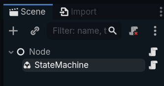
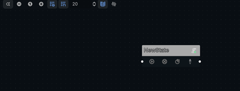
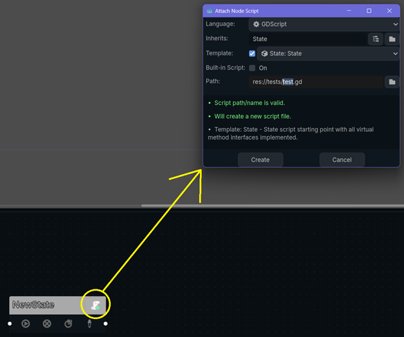
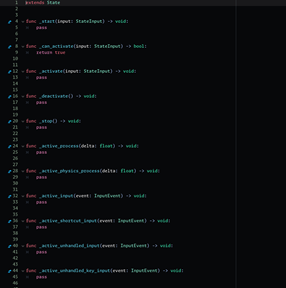
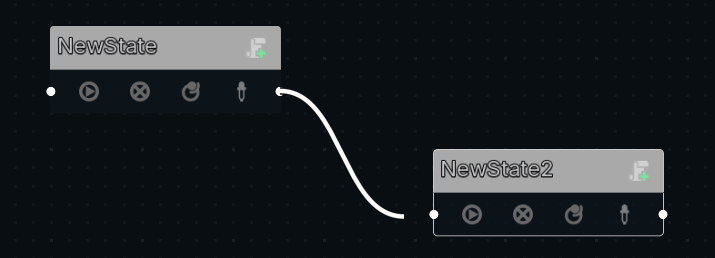
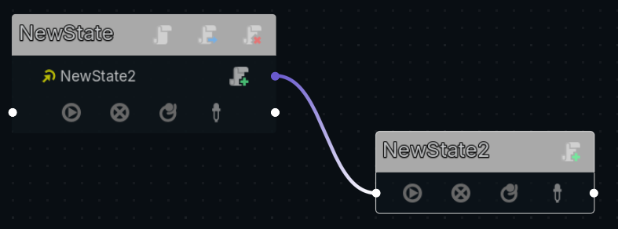
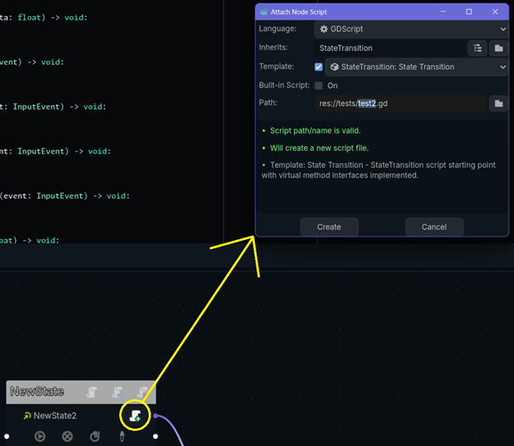

# EzFSM
 A lightweight, fast Finite State Machine implemented as a C++ GDExtension.

 ## Download
 ### From GitHub.com
 You can download the full repository for EzFSM [here](https://github.com/iiMidknightii/EzFSM).  You can clone this repository by doing `git clone https://github.com/iiMidknightii/EzFSM.git` in the directory of your choosing.

 ### From Godot Asset Library Web
 Head over to [the EzFSM page on the asset library website](https://godotengine.org/asset-library/asset) and click the download button.

 ### From Godot Asset Library in the Editor
 Click the `AssetLib` button at the top of the Godot editor and search for `EzFSM`.  From there, you can download it directly into your project.

 ## Installation
 Once you have the files downloaded, there are a couple paths you could take for installation.  The [addons/EzFSM](addons/EzFsm/) and [script_templates](./script_templates/) folders can be directly copied into your project.  It already has the binaries for debug and release builds on Windows and Linux.  From there, you can activate the EzFSM plugin for the state machine graph editor.  
 
 If you wish to build the binaries from source, you'd need to also copy the [src](./src/), [doc_classes](./doc_classes/), and [godot-cpp](./godot-cpp/) folders along with the [SConstruct](./Sconstruct) file.  [This page will tell you how to build the extension from source using the `scons` command](https://docs.godotengine.org/en/stable/tutorials/scripting/gdextension/gdextension_cpp_example.html).

The actual GDExtension classes are in the [addons/EzFSM/bin]() binaries and are added to Godot via [addons/EzFSM/ez_fsm.gdextension]().  The EzFSM plugin at [addons/EzFSM/plugin.cfg]() is just for the state machine graph editor.  This has to be enabled in the `Project`->`Project Settings ...`->`Plugins` screen.

## Tutorial
First, to create a state machine, simply add a `StateMachine` node to your scene.

[!TIP] 
When you first add a state machine, there will be warnings that tell you that you need to add states and set the default.  They will go away once we start editing the state machine.

If you have EzFSM enabled in the plugins screen, clicking the state machine node will open a blank graph editor.  You can add the first state by right clicking and selecting `Add State`, or pressing the leftmost button in the toolbar.

This adds a new state to the machine with the name `NewState`.

You can add a custom script to that state with the `Add Script` button.

[!IMPORTANT]
If you don't add a script to a state, it will not do any processing.

If you included the [script_templates]() folder in your project, you can use the default `State` template to populate the default virtual method interfaces.

Once you have two or more states added to the machine, you can connect states you wish to allow transitions between by dragging the white dot on the bottom right of one state to the white dot on the bottom left of another.

Once connected, the state that can transition *to* the other state will have a transition showing the name of the state it transitions to, as well as the ability to add a custom script to define the logic of *when* that transition will occur.  Click the name of the transition to edit its resource object.  If more than one transition is added, they are evaluated in descending order starting at the top.  You can change that order with the arrow buttons that will appear to the left of the transitions' names.  Disconnect states by dragging the purple end of the connection away from the right port of the transition.

[!IMPORTANT]
The transition will have a yellow icon if it has no script attached.  Without a script, the transition will always return `false` and therfore never activate.  Attach a script and return `true` in at least one of the virtual methods when you want to continue to the connected State.

[!TIP]
You can set a state as the default by clicking the  button, disable a state for activation/processing with the  button, allow a state to transition to itself with the  button, and change the color of a state's title bar with the  and the color picker that appears.

## Contributing
Feel free to leave any feedback, bug reports, and contributions to the repository at [https://github.com/iiMidknightii/EzFSM](https://github.com/iiMidknightii/EzFSM).